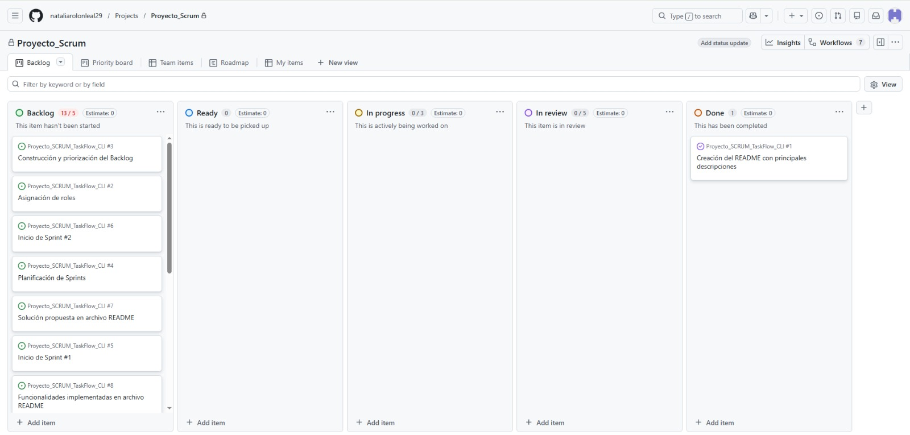
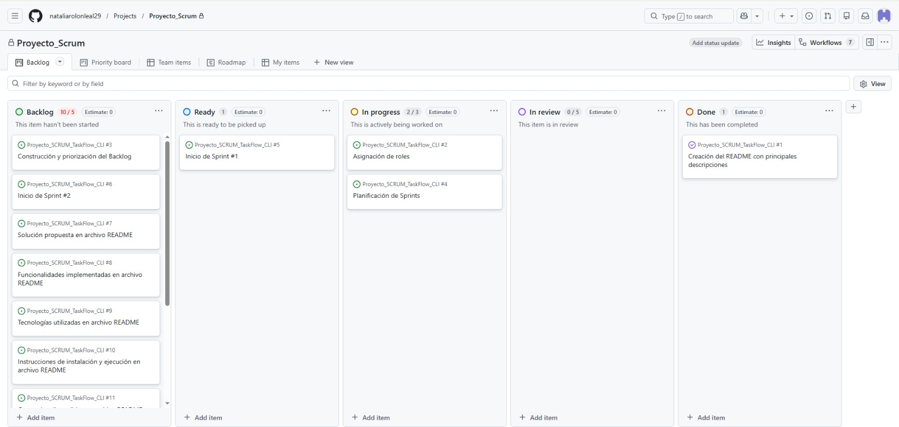
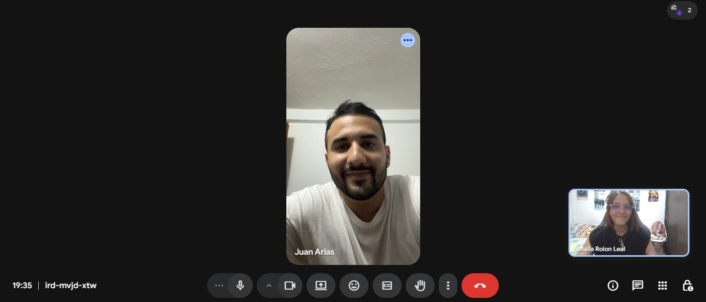
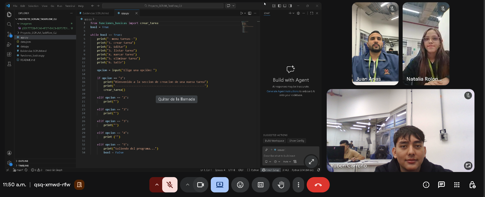
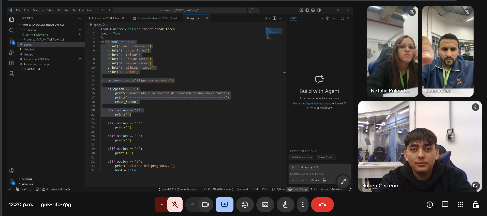

# Evidencias SCRUM

## Sprint Backlog
1. En este primer Sprint se definieron y registraron las tareas que el equipo debía realizar, organizándolas dentro del Backlog del proyecto. Estas tareas fueron priorizadas y asignadas según los objetivos establecidos para el Sprint. En la siguiente imagen se puede evidenciar cómo quedaron registradas dentro de la herramienta de gestión.

## Evidencia de Sprint Planning
1. Durante esta fase de planificación del Sprint, el equipo revisó las tareas del Backlog y realizó la organización correspondiente, cambiando el estado de algunas tareas a Ready y otras a In Progress, según su nivel de avance. En la siguiente imagen se puede observar cómo se realizó esta actualización dentro del tablero de trabajo Kanban.

## Evidencia de Daily Stand-up
1. En esta etapa se realizó una reunión breve a través de Google Meet, donde compartimos los avances realizados durante el día, las tareas en las que se está trabajando y las posibles dificultades encontradas. Esta reunión permitió mantener una comunicación constante y coordinar mejor el trabajo del equipo.

## Evidencia de Sprint Review
El día uno se realizó el Sprint 1, donde se llevó a cabo una reunión virtual para revisar el trabajo que se había realizado hasta el momento. Durante la reunión se discutieron diferentes aspectos del proyecto, se evaluó el progreso alcanzado y se compartieron opiniones para mejorar el desarrollo del trabajo.

## Evidencia de Sprint Retrospective
El día 1 se identificaron algunos errores en el proyecto, específicamente en algunas partes del menú. Para solucionarlos, se realizó una reunión virtual en la que se revisó el funcionamiento del sistema. Durante la reunión se logró identificar el origen de los errores y se realizaron las correcciones necesarias para mejorar el funcionamiento del menú y asegurar que el proyecto quedara de la mejor manera posible.

## Evidencia de refinamiento del backlog

## Definición de "Hecho" o criterios de aceptación de los incrementos

